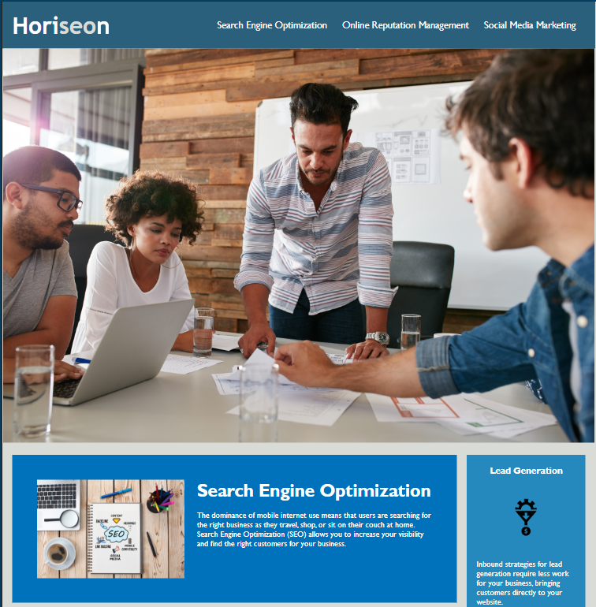

# <Horiseon-Accessibility>

## Description
The purpose of the site is to inform users of how to optimize their platform for search engines but due to functional errors and missing features it failed to be accessible to all users. I remedied this by adding alt text to images and fixing the navigation links in the site. I also simplified redundant code. My changes made the site more accessible to visually impaired users as well as improving site functionality. In doing these improvements I learned small changes can make a big difference in the code which can impair site functionality and accessibility.

## Table of Contents
- 
  - [Description](#description)
  - [Table of Contents](#table-of-contents)
  - [Installation](#installation)
  - [Usage](#usage)
  - [Credits](#credits)
  - [License](#license)

## Installation

[Visit the site here](https://johnkihm.github.io/Module-1-Challenge)

## Usage

## Credits

Starter code provided by: https://github.com/coding-boot-camp/urban-octo-telegram

## License

MIT License

Copyright (c) 2024 JohnKihm

Permission is hereby granted, free of charge, to any person obtaining a copy
of this software and associated documentation files (the "Software"), to deal
in the Software without restriction, including without limitation the rights
to use, copy, modify, merge, publish, distribute, sublicense, and/or sell
copies of the Software, and to permit persons to whom the Software is
furnished to do so, subject to the following conditions:

The above copyright notice and this permission notice shall be included in all
copies or substantial portions of the Software.

THE SOFTWARE IS PROVIDED "AS IS", WITHOUT WARRANTY OF ANY KIND, EXPRESS OR
IMPLIED, INCLUDING BUT NOT LIMITED TO THE WARRANTIES OF MERCHANTABILITY,
FITNESS FOR A PARTICULAR PURPOSE AND NONINFRINGEMENT. IN NO EVENT SHALL THE
AUTHORS OR COPYRIGHT HOLDERS BE LIABLE FOR ANY CLAIM, DAMAGES OR OTHER
LIABILITY, WHETHER IN AN ACTION OF CONTRACT, TORT OR OTHERWISE, ARISING FROM,
OUT OF OR IN CONNECTION WITH THE SOFTWARE OR THE USE OR OTHER DEALINGS IN THE
SOFTWARE.